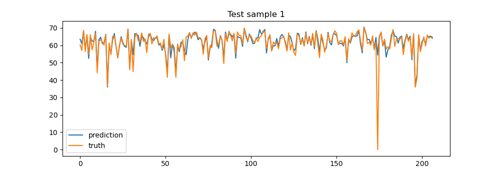
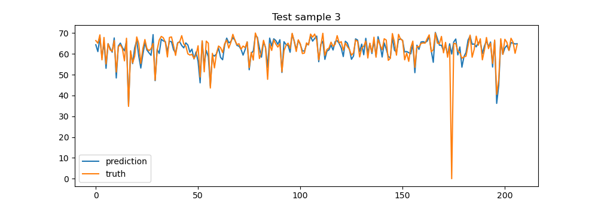
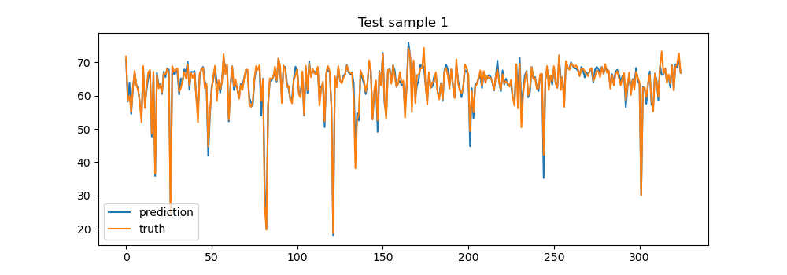
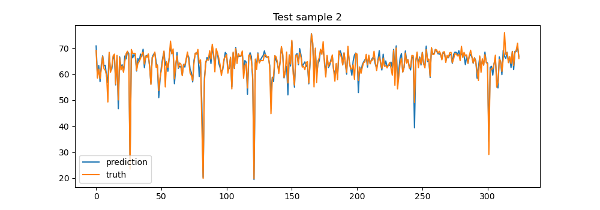
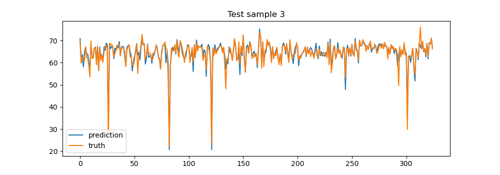

# Diffusion Convolutional Recurrent Neural Network: Data-Driven Traffic Forecasting


The implementation of this model refers to the PyTorch implementation of Diffusion Convolutional Recurrent Neural Network in the following paper: Yaguang Li, Rose Yu, Cyrus Shahabi, Yan Liu, [Diffusion Convolutional Recurrent Neural Network: Data-Driven Traffic Forecasting](https://arxiv.org/abs/1707.01926), ICLR 2018.

The original PyTorch implementation can be found at https://github.com/chnsh/DCRNN_PyTorch .

The repository has removed the TensorFlow part of the  above original PyTorch implementation  and can run in a Python environment without TensorFlow.

In particular, this implementation can be trained on Huawei Cloud ModelArts using PyCharm if desired.


## Requirements
* torch
* scipy>=0.19.0
* numpy>=1.12.1
* pandas>=0.19.2
* pyyaml
* statsmodels
* tables
* future
* TensorboardX

Dependency can be installed using the following command:
```bash
pip install -r requirements.txt
```


## Data Preparation
The traffic data files for Los Angeles (METR-LA) and the Bay Area (PEMS-BAY), i.e., `metr-la.h5` and `pems-bay.h5`, are available at [Google Drive](https://drive.google.com/open?id=10FOTa6HXPqX8Pf5WRoRwcFnW9BrNZEIX) or [Baidu Yun](https://pan.baidu.com/s/14Yy9isAIZYdU__OYEQGa_g), and should be
put into the `data/` folder.
The `*.h5` files store the data in `panads.DataFrame` using the `HDF5` file format. Here is an example:

|                     | sensor_0 | sensor_1 | sensor_2 | sensor_n |
|:-------------------:|:--------:|:--------:|:--------:|:--------:|
| 2018/01/01 00:00:00 |   60.0   |   65.0   |   70.0   |    ...   |
| 2018/01/01 00:05:00 |   61.0   |   64.0   |   65.0   |    ...   |
| 2018/01/01 00:10:00 |   63.0   |   65.0   |   60.0   |    ...   |
|         ...         |    ...   |    ...   |    ...   |    ...   |


Here is an article about [Using HDF5 with Python](https://medium.com/@jerilkuriakose/using-hdf5-with-python-6c5242d08773).

Run the following commands to generate train/test/val dataset at  `data/{METR-LA,PEMS-BAY}/{train,val,test}.npz`.
```bash
# Create data directories
mkdir -p data/{METR-LA,PEMS-BAY}

# METR-LA
python -m scripts.generate_training_data --output_dir=data/METR-LA --traffic_df_filename=data/metr-la.h5

# PEMS-BAY
python -m scripts.generate_training_data --output_dir=data/PEMS-BAY --traffic_df_filename=data/pems-bay.h5
```

## Graph Construction
 As the currently implementation is based on pre-calculated road network distances between sensors, it currently only
 supports sensor ids in Los Angeles (see `data/sensor_graph/sensor_info_201206.csv`).
```bash
python -m scripts.gen_adj_mx  --sensor_ids_filename=data/sensor_graph/graph_sensor_ids.txt --normalized_k=0.1\
    --output_pkl_filename=data/sensor_graph/adj_mx.pkl
```
Besides, the locations of sensors in Los Angeles, i.e., METR-LA, are available at [data/sensor_graph/graph_sensor_locations.csv](https://github.com/liyaguang/DCRNN/blob/master/data/sensor_graph/graph_sensor_locations.csv).


## Model Training
```bash
# Go to the code directory
cd src

# METR-LA
python dcrnn_train_pytorch.py --config_filename=model/dcrnn_la.yaml

# PEMS-BAY
python dcrnn_train_pytorch.py --config_filename=model/dcrnn_bay.yaml
```

There is a chance that the training loss will explode, the temporary workaround is to restart from the last saved model before the explosion, or to decrease the learning rate earlier in the learning rate schedule. 

## Use the trained model to generate predictions

After the model training is complete, the following code can be used to generate the prediction results of the model on the test set.

In particular, if you haven't trained the model yet, you can still use the following code directly to use the model I've trained.

```bash
# Go to the code directory
cd src

# METR-LA
python run_demo_pytorch.py --config_filename=model/pretrained/METR-LA/config.yaml --output_filename=dcrnn_prediction_la.npz

# PEMS-BAY
python run_demo_pytorch.py --config_filename=model/pretrained/PEMS-BAY/config.yaml --output_filename=dcrnn_prediction_bay.npz
```

The generated prediction file of DCRNN is in `output` folder.

## Visualize the prediction results of the model

When the prediction results file from the previous step is generated, you can use the following code to visualize some of the prediction results.

```bash
# METR-LA
python -m scripts.visualize_results --prediction_result_path=output/dcrnn_predictions_la.npz --save=fig/METR-LA

# PEMS-BAY
python -m scripts.visualize_results --prediction_result_path=output/dcrnn_predictions_bay.npz --save=fig/PEMS-BAY
```

The generated visualization of the prediction results can be found in the `fig`  folder.

### METR-LA results






### PEMS-BAY results








## Citation

If you find this repository, e.g., the code and the datasets, useful in your research, please cite the following paper:
```
@inproceedings{li2018dcrnn_traffic,
  title={Diffusion Convolutional Recurrent Neural Network: Data-Driven Traffic Forecasting},
  author={Li, Yaguang and Yu, Rose and Shahabi, Cyrus and Liu, Yan},
  booktitle={International Conference on Learning Representations (ICLR '18)},
  year={2018}
}
```
